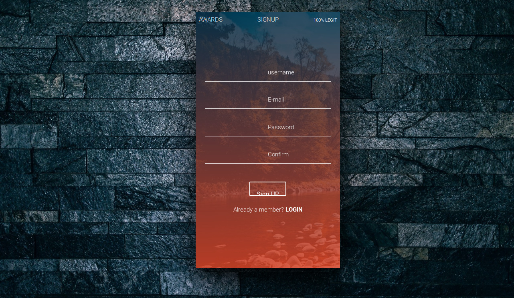

# AWARDS
> Checkout my awards application

#### This is my awards website where you can see review other peoples work that they have uploaded and rate them.


## As users you can :
* Login and post your favourites work                             l
* View different posts that interest you.
* Click on a post to view the details.
* You can leave a rate on the post.


## Usage example

1. Open the website and browse the post.
2. If you see a post that interests you, you can click on it to view more details of it and leave a rate.


## Development setup

To access the Code behind this site, you will need to:

1. Clone this repo:
  ```bash
  git clone https://github.com/raymondyegon/awards
  ```
2. Move to the folder and install requirements
  ```bash
  cd awards
  pip install -r requirements.txt
  ```
3. Create database on psql shell
  ```SQL
  psql
  CREATE DATABASE awards;
  ```
4. Migrate the database and run the application
  ```bash
  python manage.py migrate
  python manage.py runserver
  ```

## Technologies Used
* python3
* Django
* Jinja
* HTML
* Bootstrap
* css
* Materialize

## Known Bugs.
* There are currently no known bugs. If you experience any feel free to open an issue

### Support and contact details
If you have any queries regarding the my site,
Please feel free to contact on [gmail](mailto://raymondyegon17@gmail.com) and we will be happy to look into your query

## Licensing
###### This Project is under the MIT License 2019
  